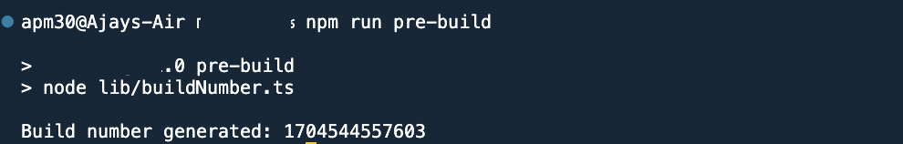
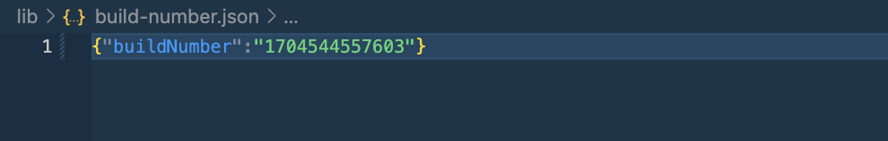
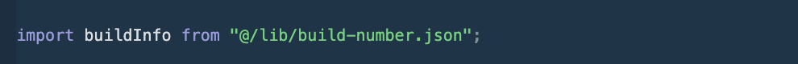
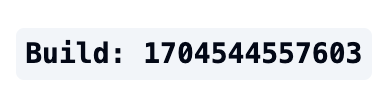

# Next.js Build Number Generator

A utility for generating build numbers in Next.js applications.

## DESCRIPTION:
Creating a custom build number for a Next.js project involves generating a unique identifier that can be associated with each build of your application. This build number can be used for various purposes, such as tracking versions, identifying deployments, or debugging.

## FEATURES: 
- Generates a unique build number for each build of your Next.js application by running <code> npm run pre-build </code> before each build. This means assigning a static build number to your application so that you have control over the build number that is generated.
- Can be totally customized to your needs. You can use the default build number generator or create your own custom build number generator by modifying the <code> generateBuildNumber </code> code in <code> generate-build-number.ts </code>.


## USAGE:
- If you just want the code, it is available in the <code> src </code> folder. You can copy the <code> src </code> folder to your project and use it.
 - In your package.json file, add the following scripts:
    ```json
    "scripts": {
        "pre-build" : "node file-path/build-generator.ts",
    }
    ```
   - When you run <code> npm run pre-build </code> , it will generate a build number and store it in a file called <code> build-number.json </code> in the root directory of your project. You can access this file in your application and use the build number.

- If you want to use the package, you can install it using npm (NOT-PUBLISHED-YET):

    ```bash
    npm install nextjs-build-number-generator
    ```

    


## KNOWN ISSUES:
 - Version Loop : If you are using a code-formatter like prettier  or pre-commit hooks (which has a code-formatter) and place pre-build command like this <code> build : "pre-build && next build" </code> it might cause a version loop. This is because the build number is generated before each build, and the build is triggered when the code is saved. So, if you are using a code-formatter, it will format the code, which will trigger a build, which will again format the code, and so on. This can be fixed by either disabling the code-formatter or by using a different code-formatter or keeping the commands in separate lines like this: 
    <code>
        "pre-build" : "npm run pre-build",
        "build" : "next build"
    </code>


## WORKING:

- The build number is generated by running <code> npm run pre-build </code> before each build. This command runs the <code> pre-build.js </code> script, which generates a build number and stores it in a file called <code> build-number.json </code>.



- The file stores the build Number as a JSON object  as seen below:



- The build number can be accessed in your application by importing the <code> build-number.json </code> file and accessing the <code> buildNumber </code> property of the JSON object.




- On production , you can see the build number in the frontend (i.e if you have used the <code> buildNumber </code> property in your application).



## LICENSE:

This project is licensed under the MIT License - see the [LICENSE](LICENSE) file for details.